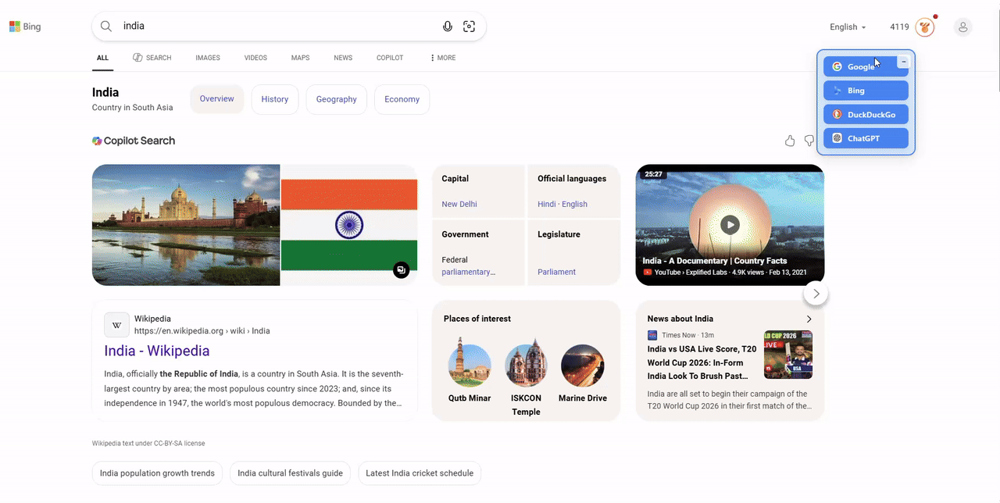
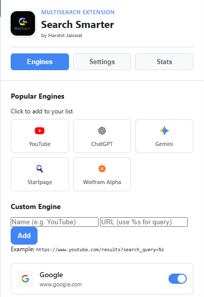
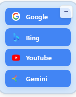

# MultiSearch Extension

> A powerful browser extension that allows you to seamlessly switch between multiple search engines while browsing. Never lose your search query when switching from Google to Bing, DuckDuckGo, or any other search engine!

[](https://github.com/harshitj183/MultiSearch.Extension)
[](LICENSE)
[](https://www.harshitj183.in)

---


## See it in Action


*Seamlessly switch search engines in one click!*

---

## Screenshots

### Extension Popup

*Easily add, remove, and manage your favorite search engines.*

### Floating Widget

*Seamlessly integrated widget to switch engines instantly.*

---

## Features

### Core Features
- **Instant Search Engine Switching** - Switch between search engines without losing your query
- **Draggable Widget** - Position the widget anywhere on your screen
- **Keyboard Shortcuts** - Quick access with Alt+1, Alt+2, Alt+3, Alt+4
- **Usage Statistics** - Track your search engine usage with detailed stats
- **Customizable Widget** - Adjust size, position, and animation speed
- **Dark Mode Support** - Automatic theme detection based on system preferences

### Advanced Features
- **Custom Search Engines** - Add your own favorite search engines
- **Popular Engines Library** - Quick-add support for YouTube, ChatGPT, Gemini, and more
- **Engine Management** - Enable/disable engines as needed
- **Position Memory** - Widget remembers its last position
- **Minimize Mode** - Collapse widget when not in use
- **Export/Import Stats** - Download your search statistics as JSON

### Supported Search Engines

#### Default Engines
- **Google** - World's most popular search engine
- **Bing** - Microsoft's search engine
- **DuckDuckGo** - Privacy-focused search
- **Yandex** - Russian search engine

#### Popular Engines (Quick Add)
- **YouTube** - Video search
- **ChatGPT** - AI-powered search and chat
- **Gemini** - Google's AI assistant
- **Startpage** - Privacy-focused Google results
- **Wolfram Alpha** - Computational knowledge engine

---

## Installation

### Quick Open (Local Preview)

If you just want to quickly open the project locally before loading it as an extension:

```bash
python3 -m http.server 8000
```

Then visit `http://localhost:8000/test.html` to open the built-in troubleshooting and test page.

### From Source (Developer Mode)

1. **Download the Extension**
   ```bash
   git clone https://github.com/harshitj183/MultiSearch.Extension.git
   cd MultiSearch.Extension
   ```

2. **Open Browser Extensions Page**
   - **Chrome/Edge**: Navigate to `chrome://extensions/` or `edge://extensions/`
   - **Brave**: Navigate to `brave://extensions/`

3. **Enable Developer Mode**
   - Toggle the "Developer mode" switch in the top-right corner

4. **Load the Extension**
   - Click "Load unpacked"
   - Select the `MultiSearch.Extension` folder
   - The extension will be installed and activated!

5. **Pin the Extension** (Optional)
   - Click the puzzle icon in your browser toolbar
   - Find "Multi Search Engine Widget"
   - Click the pin icon to keep it visible

---

## Usage

### Basic Operation

1. **Automatic Widget Display**
   - Visit any search engine (Google, Bing, DuckDuckGo, etc.)
   - The widget automatically appears in the top-right corner
   - Your current search query is automatically detected

2. **Switch Search Engines**
   - Click any search engine button in the widget
   - Your query is preserved and searched on the new engine
   - Page switches instantly to the new search results

3. **Reposition Widget**
   - Click and drag the widget by the drag handle (⋮⋮)
   - Position is automatically saved for future sessions
   - Reset position anytime from Settings

4. **Minimize Widget**
   - Click the minimize button (−) to collapse the widget
   - Click the expand button (+) to restore it
   - Minimized state is remembered

### Keyboard Shortcuts

Use these shortcuts on any search page:

```
Alt + 1    →    Switch to Google
Alt + 2    →    Switch to Bing
Alt + 3    →    Switch to DuckDuckGo
Alt + 4    →    Switch to Yandex
Alt + 5+   →    Custom engines (if added)
```

### Managing Search Engines

#### Adding Custom Engines

1. Click the extension icon in your toolbar
2. Go to the **Engines** tab
3. In the "Custom Engine" section:
   - Enter the engine name (e.g., "YouTube")
   - Enter the search URL with `%s` as query placeholder
   - Example: `https://www.youtube.com/results?search_query=%s`
4. Click **Add**

#### Adding Popular Engines

1. Click the extension icon
2. Go to the **Engines** tab
3. Click any engine from the "Popular Engines" grid
4. It's instantly added to your engine list!

#### Enabling/Disabling Engines

1. Open the extension popup
2. Go to the **Engines** tab
3. Use the toggle switch next to each engine
4. Disabled engines won't appear in the widget

#### Deleting Custom Engines

1. Find the custom engine in the Engines tab
2. Click the **×** (delete) button
3. Confirm deletion

---

## Configuration

### Widget Settings

Click the extension icon and go to **Settings** tab:

| Setting | Options | Description |
|---------|---------|-------------|
| **Default Position** | Top Right, Top Left, Bottom Right, Bottom Left | Initial widget position on search pages |
| **Widget Size** | Small, Medium, Large | Adjust widget dimensions |
| **Animation Speed** | Fast, Normal, Slow | Control transition animations |
| **Auto-minimize** | On/Off | Automatically collapse after search |
| **Show Tooltips** | On/Off | Display helpful tooltips on hover |
| **Enable Sounds** | On/Off | Play sound effects (future feature) |
| **Notifications** | On/Off | Show desktop notifications |

### Advanced Settings

| Setting | Options | Description |
|---------|---------|-------------|
| **Default Engine** | Any enabled engine | Engine used for direct searches |
| **Open in New Tab** | On/Off | Open searches in new tabs vs current |
| **Preserve History** | On/Off | Keep search history for stats |

---

## Statistics

### Viewing Stats

1. Click the extension icon
2. Go to the **Stats** tab
3. View your search analytics:
   - **Total Searches**: All-time search count
   - **Favorite Engine**: Most-used search engine
   - **Today's Searches**: Searches made today
   - **This Week**: Last 7 days search count
   - **Engine Breakdown**: Usage percentage per engine

### Managing Stats Data

#### Reset Widget Position
- Resets widget back to top-right corner
- Useful if widget gets stuck off-screen

#### Clear All Data
- Deletes all search statistics
- **Warning**: This action cannot be undone
- Settings and custom engines are preserved

#### Export Stats
- Downloads your stats as JSON file
- Filename: `multisearch-stats-YYYY-MM-DD.json`
- Useful for backup or analysis

---

## Supported Browsers

This extension works on all Chromium-based browsers:

| Browser | Minimum Version | Status |
|---------|-----------------|--------|
| Google Chrome | v88+ | Fully Supported |
| Microsoft Edge | v88+ | Fully Supported |
| Brave | v1.20+ | Fully Supported |
| Vivaldi | v3.5+ | Fully Supported |
| Opera | v74+ | Fully Supported |

**Note**: Firefox support coming in future versions!

---

## Technical Details

### Architecture

```
MultiSearch.Extension/
├── manifest.json          # Extension configuration (Manifest V3)
├── background.js          # Service worker for background tasks
├── content.js             # Content script injected into search pages
├── content.css            # Widget styling
├── popup.html             # Extension popup interface
├── popup.js               # Popup logic and settings management
├── popup.css              # Popup styling
├── icons/                 # Extension icons (16px, 48px, 128px)
└── docs/                  # Documentation and assets
    ├── assets/            # Screenshots and media
    ├── CHANGELOG.md       # Version history
    └── SECURITY.md        # Security policy
```

### Key Technologies

- **Manifest V3** - Latest Chrome extension standard
- **Chrome Extension APIs**:
  - `chrome.storage.sync` - Settings synchronization
  - `chrome.storage.local` - Statistics storage
  - `chrome.tabs` - Tab management
  - `chrome.runtime` - Messaging between components
  - `chrome.notifications` - Desktop notifications
- **Vanilla JavaScript** - No external dependencies
- **CSS3** - Modern styling with animations
- **Dark Mode** - `prefers-color-scheme` media query support

### Data Storage

- **Settings**: Stored in `chrome.storage.sync` (synced across devices)
- **Statistics**: Stored in `chrome.storage.local` (device-specific)
- **Widget Position**: Stored in `localStorage` (per-domain)
- **Max Stats History**: Last 1000 searches retained

### Privacy & Security

- **No Data Collection** - All data stays on your device
- **No External Requests** - Extension works offline
- **No Tracking** - Your searches are private
- **Open Source** - Code is publicly auditable
- **Minimal Permissions** - Only essential permissions requested

### Required Permissions

| Permission | Purpose |
|------------|---------|
| `activeTab` | Read current search query from active tab |
| `tabs` | Switch between search engine tabs |
| `storage` | Save settings and statistics |
| `notifications` | Show desktop notifications (optional) |
| `contextMenus` | Future feature: right-click context menu |

---

## Documentation

Additional documentation available in the `/docs` folder:

- **[CHANGELOG.md](docs/CHANGELOG.md)** - Version history and release notes
- **[SECURITY.md](docs/SECURITY.md)** - Security policy and vulnerability reporting
- **[assets/](docs/assets/)** - Screenshots and visual assets

---

## Contributing

Contributions are welcome! Here's how you can help:

### Reporting Issues

1. Check if the issue already exists in [Issues](https://github.com/harshitj183/MultiSearch.Extension/issues)
2. Create a new issue with:
   - Clear title and description
   - Steps to reproduce
   - Expected vs actual behavior
   - Browser version and OS
   - Screenshots (if applicable)

### Suggesting Features

1. Open an issue with the "Feature Request" label
2. Describe the feature and its benefits
3. Provide examples or mockups if possible

### Submitting Pull Requests

1. Fork the repository
2. Create a feature branch (`git checkout -b feature/amazing-feature`)
3. Make your changes
4. Test thoroughly
5. Commit with clear messages (`git commit -m 'Add amazing feature'`)
6. Push to your fork (`git push origin feature/amazing-feature`)
7. Open a Pull Request

### Development Setup

```bash
# Clone the repository
git clone https://github.com/harshitj183/MultiSearch.Extension.git
cd MultiSearch.Extension

# Make your changes
# Test in browser (Load unpacked in Developer mode)

# Commit and push
git add .
git commit -m "Your changes"
git push origin your-branch
```

---

## Troubleshooting

### Widget Not Appearing

1. **Reload the extension**:
   - Go to `chrome://extensions/`
   - Find "Multi Search Engine Widget"
   - Click the refresh icon

2. **Hard refresh the search page**:
   - Press `Ctrl + Shift + R` (Windows/Linux)
   - Press `Cmd + Shift + R` (Mac)

3. **Check browser console**:
   - Press `F12` on the search page
   - Look for errors in Console tab
   - Should see: "Multi Search Engine Widget loaded!"

### Stats Not Updating

1. **Clear browser cache**:
   - Press `Ctrl + Shift + Delete`
   - Clear "Cached images and files"
   - Reload extension

2. **Check storage permissions**:
   - Extension must have `storage` permission enabled

3. **Reset stats**:
   - Open extension popup → Stats tab
   - Click "Clear All Data"
   - Try searching again

### Widget Position Issues

- **Widget stuck off-screen**: Click "Reset Position" in Stats tab
- **Widget won't stay**: Make sure you're dragging by the handle (⋮⋮)
- **Position not saving**: Check `localStorage` is enabled in browser

---

## Roadmap

### Upcoming Features

- [ ] Firefox support
- [ ] Mobile browser support (Kiwi, Firefox Mobile)
- [ ] Multi-language support
- [ ] Custom themes and color schemes
- [ ] Right-click context menu integration
- [ ] Search history sync across devices
- [ ] AI-powered search suggestions
- [ ] Advanced analytics and insights
- [ ] Encrypted settings backup
- [ ] Performance optimizations

---

## Support

Need help? Here's how to get support:

- **Email**: Contact via [www.harshitj183.in](https://www.harshitj183.in)
- **GitHub Issues**: [Report bugs or request features](https://github.com/harshitj183/MultiSearch.Extension/issues)
- **GitHub Discussions**: [Community support](https://github.com/harshitj183/MultiSearch.Extension/discussions)

---

## Author

**Harshit Jaiswal**

- Website: [www.harshitj183.in](https://www.harshitj183.in)
- GitHub: [@harshitj183](https://github.com/harshitj183)
- Contact: Available on website

---

## Show Your Support

If you find this extension helpful, please consider:

- Starring this repository
- Reporting bugs and requesting features
- Contributing code or documentation
- Sharing with friends and colleagues
- [Buy me a coffee](https://www.harshitj183.in) (if you're feeling generous!)

---

## License

This project is licensed under the **MIT License** - see the [LICENSE](LICENSE) file for details.

```
MIT License

Copyright (c) 2024 Harshit Jaiswal

Permission is hereby granted, free of charge, to any person obtaining a copy
of this software and associated documentation files (the "Software"), to deal
in the Software without restriction, including without limitation the rights
to use, copy, modify, merge, publish, distribute, sublicense, and/or sell
copies of the Software, and to permit persons to whom the Software is
furnished to do so, subject to the following conditions:

The above copyright notice and this permission notice shall be included in all
copies or substantial portions of the Software.
```

---

<div align="center">

**Made with Love by [Harshit Jaiswal](https://www.harshitj183.in)**

*If you have any questions or suggestions, feel free to reach out!*

[Back to Top](#multisearch-extension)

</div>
